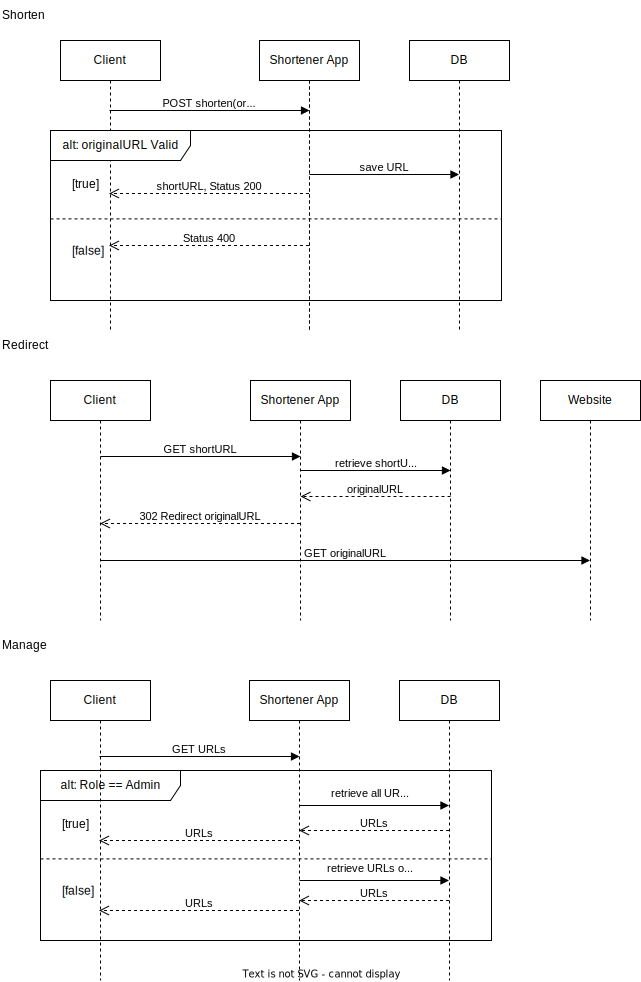

# URL Shortener

The URL Shortener is a web application that allows users to shorten long URLs into shorter, more manageable links. It provides a convenient way to share links on social media platforms, emails, or any other medium where long URLs may be cumbersome.

## Features

- Shorten URLs: Users can enter a long URL and the application will generate a unique, shortened URL.
- Analytics: The application tracks the number of clicks and provides analytics on the usage of each shortened URL.
- Redirects: When a shortened URL is accessed, the application redirects the user to the original long URL.

## Usage

1. Open the application in your web browser.
2. Enter a long URL that you want to shorten.
3. Click the "Shorten" button to generate the shortened URL.
4. Copy the shortened URL and share it with others.

## Sequence Diagram

## Contributing

Contributions are welcome! If you have any ideas, suggestions, or bug reports, please open an issue or submit a pull request.

## License

This project is licensed under the [MIT License](LICENSE).

